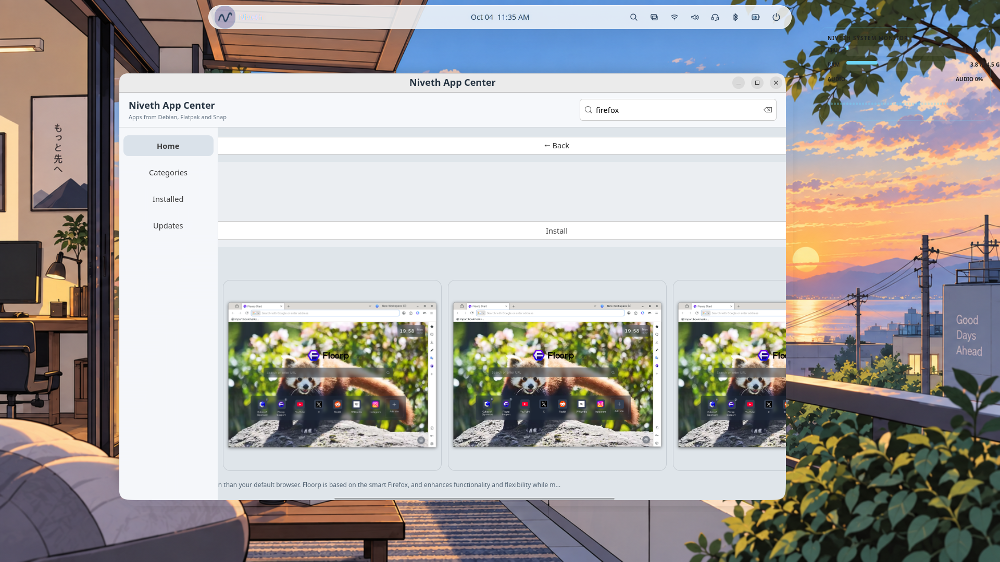
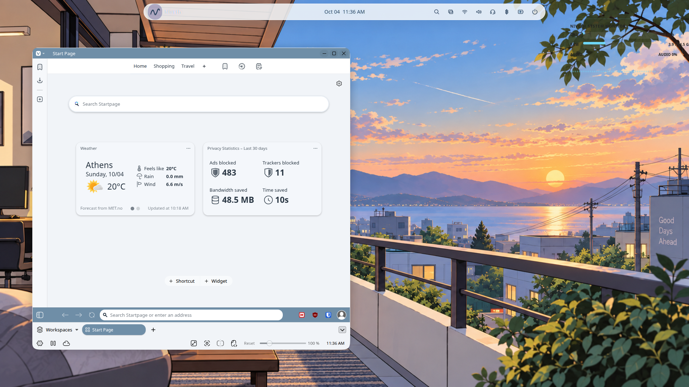
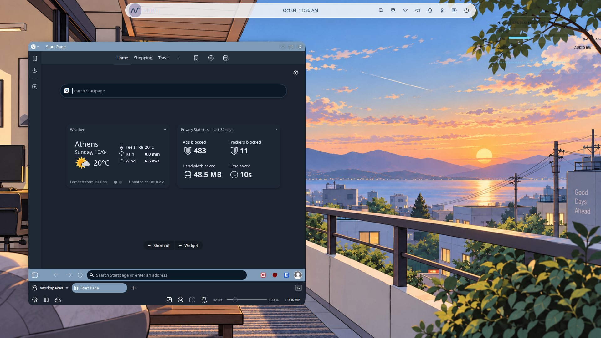
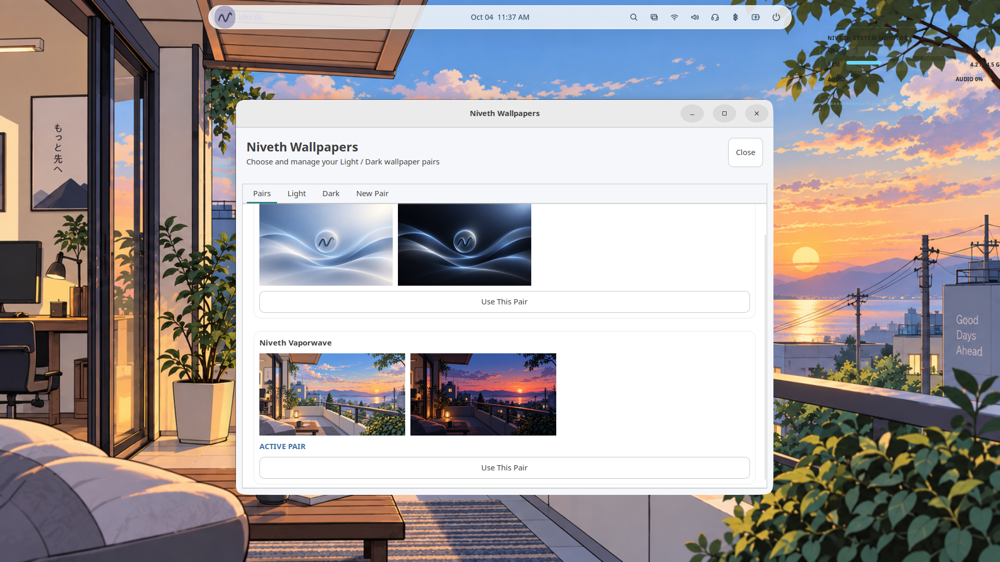

# Niveth Linux

Niveth Linux is a custom Linux distribution focused on a calm, simple and polished desktop experience.

## About

Niveth 0.1 is built on Ubuntu 26.04 LTS and uses GNOME as its desktop environment.

The project includes custom desktop configuration, wallpapers and visual assets, GNOME defaults, Kitty configuration, Vivaldi configuration, Niveth desktop components, Calamares installer configuration, audio and mouse sound integration, and ISO build and validation scripts.

## Features

### Niveth Desktop

A customized GNOME desktop with Niveth visual identity and integrated desktop components.

### Niveth App Center

Application discovery and installation through the Niveth app center.

### Vivaldi Integration

#### Light Theme

#### Dark Theme

Integrated Vivaldi configuration with automatic light and dark theme handling.

### Niveth Wallpapers

Custom Niveth wallpaper artwork and Light/Dark wallpaper pairs.

### Sound Experience

Integrated keyboard and mouse sound functionality.

## Project Structure

The Niveth repository is organized into clear areas for the operating system, desktop experience, installer, packages, documentation, and build tooling.

| Path | Purpose |
| --- | --- |
| branding/ | Operating system branding and identity |
| desktop/ | GNOME configuration, themes, wallpapers, icons and desktop components |
| installer/ | Calamares configuration and installer branding |
| packages/ | Package definitions used by the project |
| scripts/ | Build, setup and validation scripts |
| tests/ | Project test files |
| tools/ | Development tools |
| docs/ | Documentation and Niveth screenshots |
| .github/workflows/ | GitHub Actions validation workflows |
| project.conf | Niveth project configuration |
| README.md | Project overview and documentation |
| CONTRIBUTING.md | Contribution and development guidelines |

## Building Niveth

Run the preflight checks:

    ./scripts/build-snapshot-iso.sh --preflight

Build the ISO:

    ./scripts/build-snapshot-iso.sh --build

## Development

Start from the latest main branch, create a development branch, make your changes, commit them and push the branch to GitHub.

## Pull Requests
The main branch is protected. Changes should be submitted through Pull Requests and reviewed before being merged into main.

## Status
Niveth Linux 0.1 is under active development.

## Repository

https://github.com/panosxdIx/Niveth
