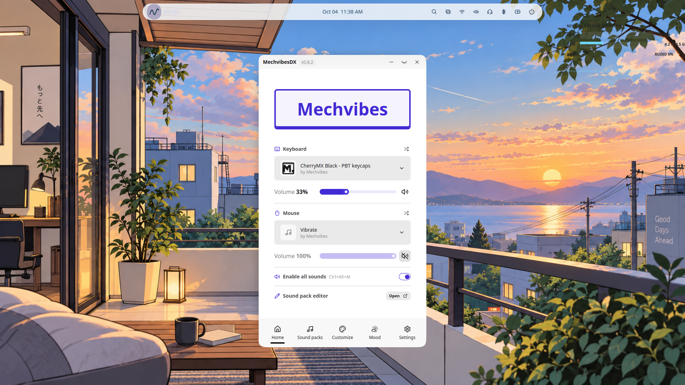

# Niveth Linux

Niveth Linux is a custom Linux distribution focused on a calm, simple and polished desktop experience.

## About

Niveth 0.1 is built on Ubuntu 26.04 LTS and uses GNOME as its desktop environment.

The project includes custom desktop configuration, wallpapers and visual assets, GNOME defaults, Kitty configuration, Vivaldi configuration, Niveth desktop components, Calamares installer configuration, audio and mouse sound integration, and ISO build and validation scripts.

## Features

### Niveth Desktop


A customized GNOME desktop with NIVETX visual identity and integrated desktop components.

### Niveth App Center


Niveth App Center provides application discovery and installation from supported software sources.

### Vivaldi Integration

#### Light Theme


#### Dark Theme


Niveth includes integrated Vivaldi configuration with automatic light and dark theme handling.

### Niveth Wallpapers


The Niveth wallpaper manager provides Light/Dark wallpaper pairs and custom Niveth artwork.

### Sound Experience



Niveth includes integrated keyboard and mouse sound functionality through MechvibesDX.

## Project Structure

```text
Niveth/
├── branding/
├── desktop/
├── installer/
├── packages/
├── scripts/
├── tests/
├── tools/
├── docs/
│   └── screenshots/
├── project.conf
├── README.md
└── CONTRIBUTING.md
```

## Building Niveth

Run the preflight checks:

```text
./scripts/build-snapshot-iso.sh --preflight
```

Build the ISO:

```text
./scripts/build-snapshot-iso.sh --build
```

## Development

Create a development branch from `main`, make your changes, commit them and push the branch to GitHub.

## Pull Requests

The `main` branch is protected. Changes should be submitted through Pull Requests and reviewed before being merged into `main`.

## Status

Niveth Linux 0.1 is under active development.

## Repository

https://github.com/panosxdIx/Niveth
